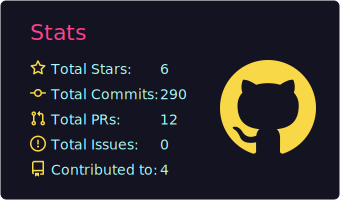

<!-- ╔═══════════════════ BOARDING PASS ═══════════════════╗ -->

<table width="100%">
<tr>
<td width="65%" align="left">

### &nbsp;✈&nbsp; METROPOLIS AIRWAYS
**`BOARDING PASS`** · *Class of 2027*

</td>
<td width="35%" align="right">

**FLIGHT** &nbsp; `MA · 2027` 
`▌▌█▌▌█▌▌▌█▌█▌▌█▌▌█▌█▌▌█`

</td>
</tr>
</table>

<table width="100%">
<tr>
<td align="left" width="28%">

`PASSENGER` 
**MUSTAFE AHMED** 
<code>@Musteab</code>

</td>
<td align="center" width="28%">

`ROUTE` 
**ADD ✈ KUL** 
Addis → Kuala Lumpur

</td>
<td align="center" width="22%">

`GATE` 
**SUNWAY** 
Computer Science

</td>
<td align="right" width="22%">

`SEAT` 
**27A** 
Builder Class

</td>
</tr>
</table>

──────────────────────────  ✂  ──────────────────────────

---

### 🧳 &nbsp; `CARGO MANIFEST`

<i>Carry-on only — no dead frameworks allowed.</i>

---

### 📡 &nbsp; `IN-FLIGHT LOG`

- 🛠 &nbsp; **Currently building** → TableTap — full-stack restaurant ops platform (Django + Next.js)
- 📚 &nbsp; **Studying** → distributed systems, real-time WebSockets, clean architecture
- 🎮 &nbsp; **Side ops** → Unity & Godot experiments when the laptop fan needs a break
- 🍵 &nbsp; **Fuel status** → matcha tank: full

---

<table width="100%">
<tr>

<td width="50%" valign="top" align="center">

### 📡 &nbsp; `TRANSMISSION LOG`

</td>
</tr>
</table>

---

### 🌆 &nbsp; `FLIGHT PATH OVER METROPOLIS`

<!-- 3D contribution skyline — auto-generated daily by the workflow below -->

---

### 🛬 &nbsp; `ARRIVAL GATE`

&nbsp;

&nbsp;

  

`▌▌█▌▌▌█▌▌█▌█▌▌█▌▌█▌█▌▌█▌▌█▌▌▌█▌▌█▌█▌▌█▌▌█▌█▌▌█` 
<i>END OF BOARDING PASS · Thank you for flying Metropolis Airways</i>

