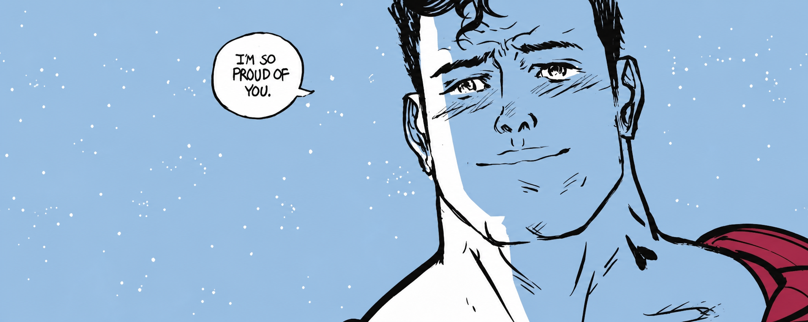
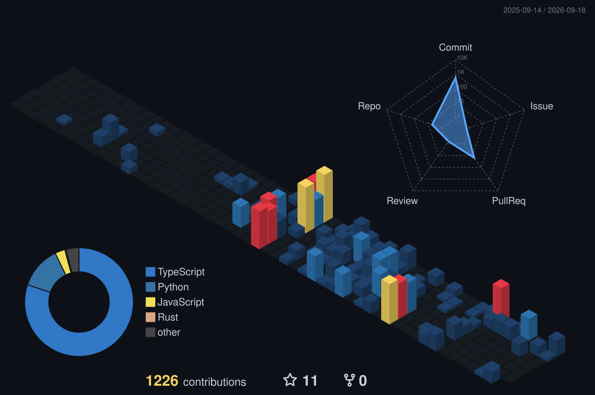

<!-- Profile repository: Musteab/musteab -->

  

<h1 align="center">Muste</h1>

  <code>meow moew BUILD LOG // ver '27</code>

  Tryna be Full-stack &amp; wanna be AI engineer · CS @ Sunway University · Co-founder of
  <a href="https://github.com/TableTapET">TableTap</a>

  
  

### Stack

  

### looks cool ryt

  

