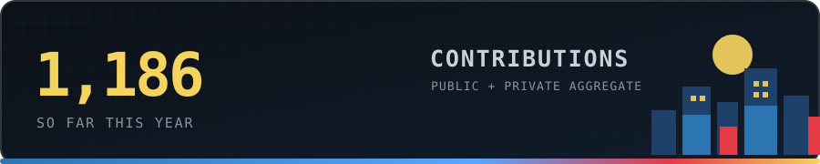

<!-- Profile repository: Musteab/musteab -->

  

<h1 align="center">Mustafe Abdilahi Ahmed</h1>

  <code>METROPOLIS BUILD LOG // ISSUE '27</code>

  Full-stack &amp; AI engineer · CS @ Sunway University · Co-founder of
  <a href="https://github.com/TableTapET">TableTap</a>

  
  

> I build production systems where correctness can be measured—not asserted.

### Selected builds

- **[TableTap](https://github.com/TableTapET)** — Multi-tenant cloud EPOS working with **10+ restaurant partners**, with guest-to-kitchen order propagation in **under one second**. 
  `Django` · `Next.js` · `PostgreSQL` · `MongoDB` · `Redis` · `Docker`

- **[PulseOps](https://github.com/Musteab/pulseops)** — Fault-injected data platform that accounted for **250/250 test faults**; a 5,022-event Pub/Sub run reproduced the offline result at **67 ms p95** with zero failures. 
  `Python` · `BigQuery` · `dbt` · `Pub/Sub` · `Terraform`

- **[rust-analyzer PR #22996](https://github.com/rust-lang/rust-analyzer/pull/22996)** — Fixed multiline `rust-toolchain.toml` component detection upstream and added six regression tests. 
  `TypeScript` · `TOML` · `VS Code Extension API`

### Stack

  

### Contribution signal

  

### Metropolis, one commit at a time

  

